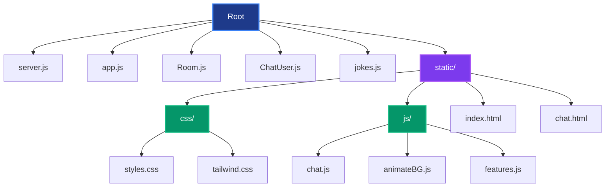
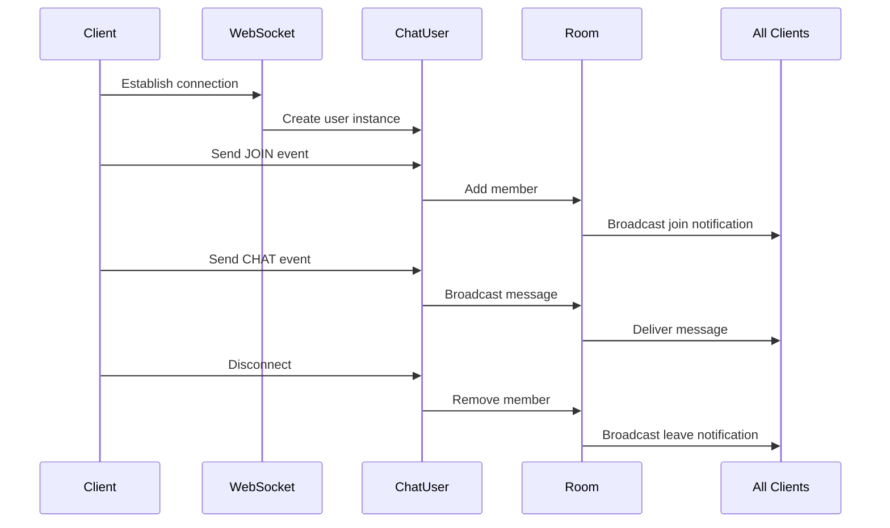
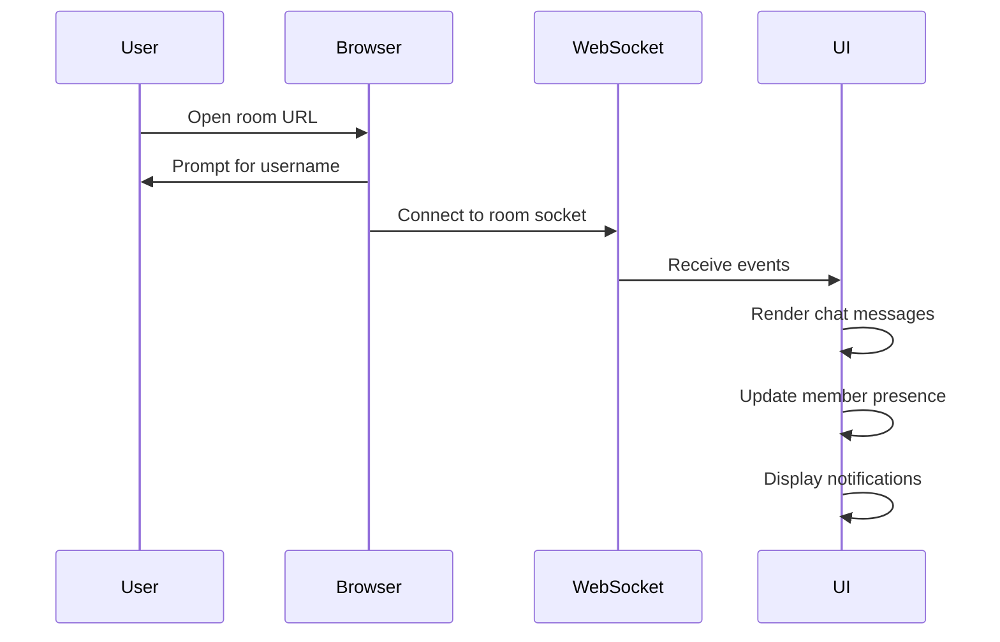

# PulseChat — Anonymous WebSocket Chatrooms

PulseChat is a real-time anonymous chatroom application built using Express and WebSockets (`express-ws`). The platform enables instant topic-based conversations without requiring user accounts or identity storage.

## 📸 Screenshots

<!-- Add your website screenshots here -->


---

## 🌟 Overview

PulseChat provides:

* Real-time messaging via WebSockets
* Dynamic room-based conversations
* Anonymous participation (no authentication layer)
* Live member presence updates
* Optional server-generated joke messages
* Responsive modern UI
* Animated canvas-based background

---

## 🛠️ Tech Stack

### Backend


### Frontend
 


### Tools & Libraries


---

## 📂 Project Structure



---

## 🏗️ Application Architecture

PulseChat follows a WebSocket-driven event model.

### Backend Event Flow



### Frontend Flow



---

## ⚙️ Core Functionalities

### Room Management
* Dynamic room creation via URL
* In-memory room registry

### Real-Time Messaging
* Instant message broadcasting
* Server-sent events (notes, chat, members)

### Presence Awareness
* Join / Leave detection
* Live member count updates

### Server Utilities
* Joke generation via external API

---

## 🔒 Privacy Model

PulseChat is designed as an anonymous communication platform.

* **No account system**
* **No identity persistence**
* **No message storage**
* **All sessions are temporary**

---

## 🚀 Getting Started

### Prerequisites
* Node.js (v14 or higher)
* npm or yarn

### Installation

1. Clone the repository
```bash
git clone https://github.com/yourusername/pulsechat.git
cd pulsechat
```

2. Install dependencies
```bash
npm install
```

3. Start the server
```bash
npm start
```

4. Open your browser and navigate to
```
http://localhost:3000
```

---

## 📝 Usage

1. **Home Page**: Browse available chatrooms or create a custom room
2. **Join Room**: Click on any room or create your own
3. **Enter Username**: Provide a temporary username (not stored)
4. **Start Chatting**: Send messages in real-time with other users

---

## 🎨 Features

* **Anonymous Chatting**: No registration required
* **Real-time Communication**: Powered by WebSockets
* **Dynamic Rooms**: Create custom rooms on the fly
* **Responsive Design**: Works on desktop, tablet, and mobile
* **Animated Background**: Modern canvas-based animations
* **Live Presence**: See who's online in real-time

---

## 🤝 Contributing

Contributions are welcome! Please feel free to submit a Pull Request.

---

## 📧 Contact

* **Email**: 2003abinashdash@gmail.com
* **LinkedIn**: AbiDev2003

---

## 🙏 Acknowledgments

* Built with Express and WebSockets
* Icons by Lucide
* Map integration by OpenStreetMap

---

**© 2026 PulseChat. All rights reserved.**